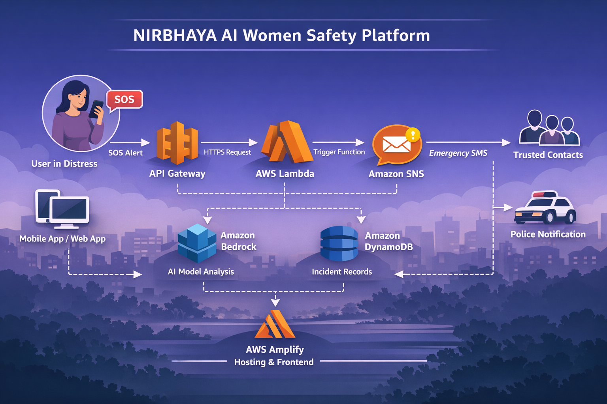

# NIRBHAYA AI — Women's Safety Platform

NIRBHAYA AI is an AI-powered women safety platform designed to detect dangerous situations and instantly alert trusted contacts.

This project was built for the **AI for Bharat Hackathon** using a fully serverless AWS architecture.

---

## Problem

Women often face unsafe situations where quick help is needed. Traditional safety apps require manual interaction which may not always be possible during emergencies.

---

## Solution

NIRBHAYA AI uses AI-based threat analysis to detect potential danger levels and automatically notify trusted contacts through SMS alerts.

---

## Key Features

- AI-based threat level detection
- Emergency alert system
- SMS notification to trusted contacts
- Serverless AWS architecture
- Lightweight web interface

---

## AWS Architecture

This project uses a fully serverless architecture.

Frontend → AWS Amplify  
Backend → AWS Lambda  
API Layer → Amazon API Gateway  
Database → Amazon DynamoDB  
SMS Alerts → Amazon SNS  
AI Analysis → Amazon Bedrock  

---

## Architecture Diagram

---

## Project Structure

nirbhaya-ai
│
├── backend
│   ├── index.js
│   └── package.json
│
├── frontend
│   ├── index.html
│   ├── script.js
│   └── style.css
│
├── .env.example
├── PROJECT_SUMMARY.md
├── README.md
└── aws-architecture.png

---

## Live Demo

Frontend deployed using AWS Amplify

https://nirbhaya-ai.dlp3wci6h4j67.amplifyapp.com/
